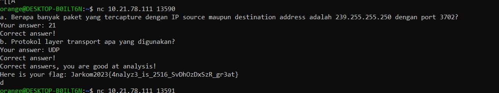
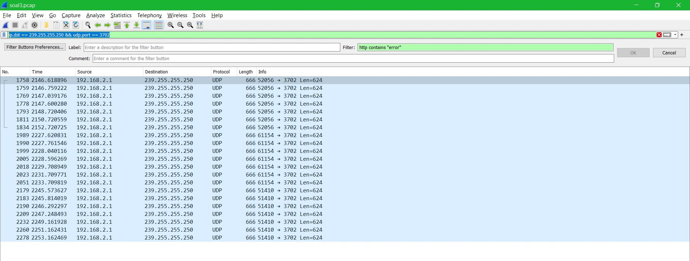
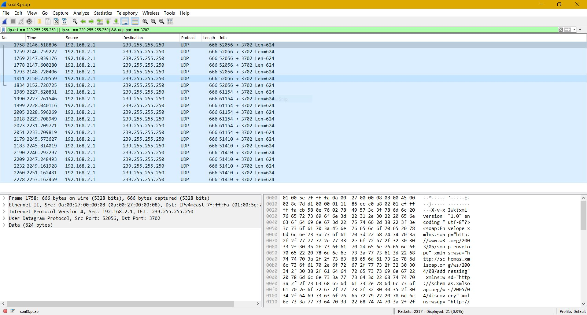
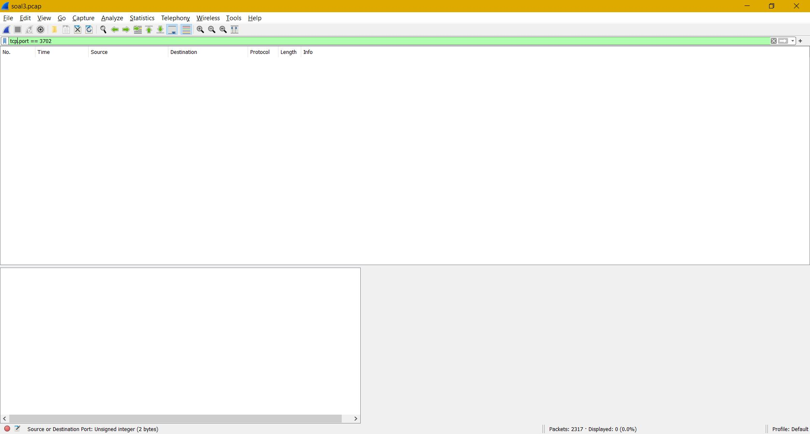
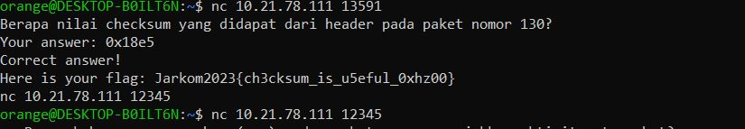
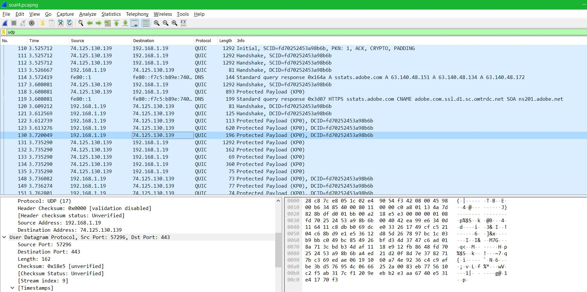
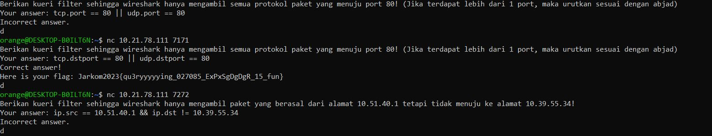

# Jarkom-Modul-1-B22-2023

## No 1

## No 2

## No 3

### Soal :

> Dapin sedang belajar analisis jaringan. Bantulah Dapin untuk mengerjakan soal berikut:
> 1. Berapa banyak paket yang tercapture dengan IP source maupun destination address adalah 239.255.255.250 dengan port 3702?
> 2. Protokol layer transport apa yang digunakan?

### Jawaban :

Paket-paket yang memenuhi kriteria bisa ditemukan menggunakan “display filter” dengan filter 

> “ip.dst == 239.255.255.250 && udp.port == 3702”.

Penjelasan :

- Filter mencari paket dengan IP destination 239.255.255.250 DAN yang menggunakan protokol UDP dengan port 3702.
- Tidak ada paket dengan source IP tersebut, sehingga jika menggunakan filter 

    > "(ip.dst == 239.255.255.250 || ip.src == 239.255.255.250) && udp.port == 3702" 

    akan didapatkan hasil yang sama.
- Tidak ada paket dengan IP tersebut yang menggunakan protokol TCP, sehingga digunakan filter UDP.

### Bukti :

Jawaban :

Filter “ip.dst == 239.255.255.250 && udp.port == 3702” :

Filter "(ip.dst == 239.255.255.250 || ip.src == 239.255.255.250) && udp.port == 3702" :

Bukti bahwa tidak ada paket dengan IP 3702 yang menggunakan protokol TCP :

## No 4

### Soal :

> Berapa nilai checksum yang didapat dari header pada paket nomor 130?

### Jawaban :

Hanya perlu melihat file .pcap dalam wireshark dan melihat nilai checksum dari paket nomor 130.

### Bukti :

Jawaban :

Screenshot wireshark :

## No 5

## No 6

## No 7

## No 8

### Soal :

> Berikan kueri filter sehingga wireshark hanya mengambil semua protokol paket yang menuju port 80! (Jika terdapat lebih dari 1 port, maka urutkan sesuai dengan abjad).

### Jawaban :

> "tcp.dstport == 80 || udp.dstport == 80"

No 8 bisa dijawab menggunakan display filter tersebut dengan penjelasan sebagai berikut :

- tcp.dstport == 80 : Packet yang berasal dari koneksi tcp yang didalamnya mencakup protokol seperti SMPT, HTTP, dan OCSP dengan port 80
- udp.dstport == 80 : Packet yang berasal dari koneksi udp yang didalamnya mencakup protokol seperti MDNS, DNS, dan LLMNR dengan port 80
- || : OR, selama salah satu kondisi di atas dipenuhi, packet diambil.

### Bukti :

## No 9

## No 10