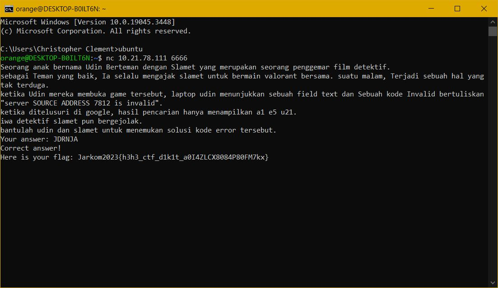

# Jarkom-Modul-1-B22-2023

## No 1

## No 2

## No 3

### Soal :

> Dapin sedang belajar analisis jaringan. Bantulah Dapin untuk mengerjakan soal berikut:
> 1. Berapa banyak paket yang tercapture dengan IP source maupun destination address adalah 239.255.255.250 dengan port 3702?
> 2. Protokol layer transport apa yang digunakan?

### Jawaban :

Paket-paket yang memenuhi kriteria bisa ditemukan menggunakan “display filter” dengan filter 

> `ip.dst == 239.255.255.250 && udp.port == 3702`.

Penjelasan :

- Filter mencari paket dengan IP destination 239.255.255.250 DAN yang menggunakan protokol UDP dengan port 3702.
- Tidak ada paket dengan source IP tersebut, sehingga jika menggunakan filter 

    > `(ip.dst == 239.255.255.250 || ip.src == 239.255.255.250) && udp.port == 3702` 

    akan didapatkan hasil yang sama.
- Tidak ada paket dengan IP tersebut yang menggunakan protokol TCP, sehingga digunakan filter UDP.

### Bukti :

Jawaban :

Filter `ip.dst == 239.255.255.250 && udp.port == 3702` :

Filter `(ip.dst == 239.255.255.250 || ip.src == 239.255.255.250) && udp.port == 3702` :

Bukti bahwa tidak ada paket dengan IP 3702 yang menggunakan protokol TCP :

## No 4

### Soal :

> Berapa nilai checksum yang didapat dari header pada paket nomor 130?

### Jawaban :

Hanya perlu melihat file .pcap dalam wireshark dan melihat nilai checksum dari paket nomor 130.

### Bukti :

Jawaban :

Screenshot wireshark :

## No 5

### Soal :

> Elshe menemukan suatu file packet capture yang menarik. Bantulah Elshe untuk menganalisis file packet capture tersebut.
> 1. Berapa banyak packet yang berhasil di capture dari file pcap tersebut?
> 2. Port berapakah pada server yang digunakan untuk service SMTP?
> 3. Dari semua alamat IP yang tercapture, IP berapakah yang merupakan public IP?

**Note : Soal tidak memberi informasi port untuk menjawab soal di website**

**Terdapat pula zip file bernama "zippppfileee.zip" yang berisi file "connect.txt" yang hanya bisa diakses menggunakan password**

### Jawaban :

Pengamatan pertama : File .pcap memiliki banyak paket dengan protokol SMTP yang berisi informasi suatu email.

Pengamatan kedua : Jika file .txt dikunci, mungkin password bisa ditemukan di dalam paket-paket yang direkam dalam file .pcap.

Terdapat 2 cara untuk mencari password yang dibutuhkan :
1. Jika kita menggunakan display filter `smtp` lalu mengakses menu `Analyze -> Follow` maka akan terdapat pilihan untuk `TCP Stream`. Maka akan ditampilkan semua informasi mengenai email termasuk password.
2. Jika kita langsung mencari tahu apakah ada pembicaraan mengenai file .zip ynag kita miliki dalam email tersebut, kita bisa menggunakan display filter `smtp contains "zip"`. Maka ada ditemukan 1 paket yang di dalamnya terdapat password.

Email juga menyebutkan bahwa password dalam email berbentuk base64. Setelah dikonversi menjadi teks maka didapatkan password : `5implePas5word`.

Menggunakan password di atas, file "connect.txt" bisa diakses :

Maka pertanyaan soal bisa dijawab :
1. Jumlah paket bisa dihitung dengan melihat nomor paket terakhir : `60`.
2. Port bisa diamati juga dengan melihat bahwa semua paket email dikirim menuju port `25`.
3. Hanya terdapat 4 IP Address unik dalam file .pcap dan yang masuk dalam range public IP adalah `74.53.140.153`.

### Bukti :

Jawaban :

Metode 1 untuk mencari password :

Metode 2 untuk mencari password :

<h2 style="color:red;">No 6 (REVISI)</h2>

### Soal :

> Seorang anak bernama Udin Berteman dengan SlameT yang merupakan seorang penggemar film detektif. sebagai teman yang baik, Ia selalu mengajak slamet untuk bermain valoranT bersama. suatu malam, terjadi sebuah hal yang tak terdUga. ketika udin mereka membuka game tersebut, laptop udin menunjukkan sebuah field text dan Sebuah kode Invalid bertuliskan "server SOURCE ADDRESS 7812 is invalid". ketika ditelusuri di google, hasil pencarian hanya menampilkan a1 e5 u21. jiwa detektif slamet pun bergejolak. bantulah udin dan slamet untuk menemukan solusi kode error tersebut.

### Jawaban :

Terdapat beberapa clue :

1. `a1 e5 u21` merujuk pada *A1Z26 cipher*, cipher subtitusi yang mengganti huruf dengan A=1, B=2, C=3, dst.

2. Dalam soal, untuk kata-kata di luar tanda kutip bisa dilihat bahwa penggunaan huruf besarnya aneh. Jika diambil, maka semua huruf besar menyusun kalimat `SUBSTITUSI` yang mendukung pengamatan 1.

3. **SOURCE ADDRESS 7812**, jika .pcap dibuka, maka terlihat bahwa jumlah paket yang ditangkap sangat banyak, sehingga kita bisa menemukan paket urutan `7812`.

Maka, jika kita cari paket nomor 7812 dan melihat alamat IP Sourcenya, kita mendapat IP `104.18.14.101`. Jika kita susun sedemikian rupa sehingga menjadi input valid untuk A1Z26 decoder (`10-4-18-14-10-1`) maka didapatkan jawaban soal yaitu `JDRNJA`.

### Bukti :

### Kesulitan :

> Karena hasil dekripsi bukan berupa kata yang bermakna, maka kami berpikir bahwa itu bukan jawaban sesungguhnya tanpa mencoba terlebih dahulu. Kami juga sempat berpikir bahwa yang diminta adalah salah satu id error game valorant sesungguhnya sehingga kami mencoba mengolah isi dari file .pcap. 

## No 7

## No 8

### Soal :

> Berikan kueri filter sehingga wireshark hanya mengambil semua protokol paket yang menuju port 80! (Jika terdapat lebih dari 1 port, maka urutkan sesuai dengan abjad).

### Jawaban :

> `tcp.dstport == 80 || udp.dstport == 80`

No 8 bisa dijawab menggunakan display filter tersebut dengan penjelasan sebagai berikut :

- `tcp.dstport == 80` : Packet yang berasal dari koneksi tcp yang didalamnya mencakup protokol seperti SMPT, HTTP, dan OCSP dengan port 80
- `udp.dstport == 80` : Packet yang berasal dari koneksi udp yang didalamnya mencakup protokol seperti MDNS, DNS, dan LLMNR dengan port 80
- `||` : OR, selama salah satu kondisi di atas dipenuhi, packet diambil.

### Bukti :

## No 9

## No 10